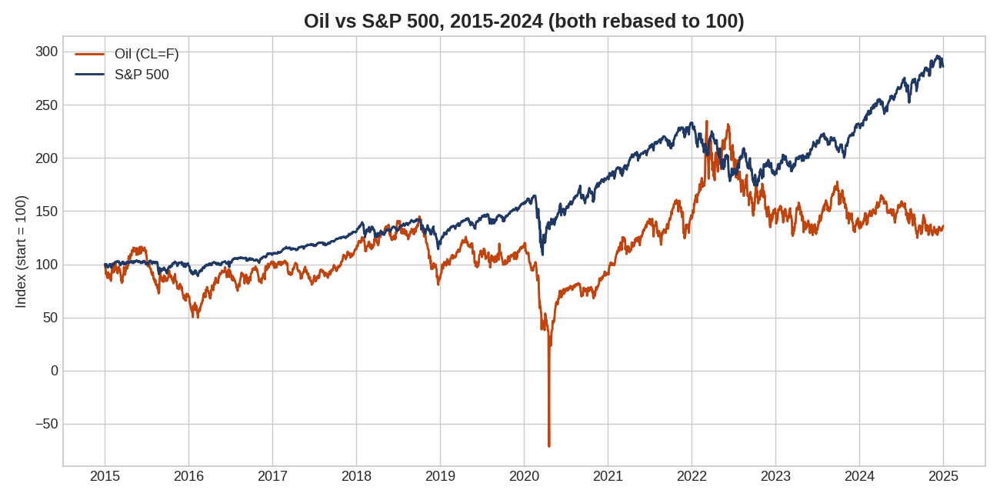
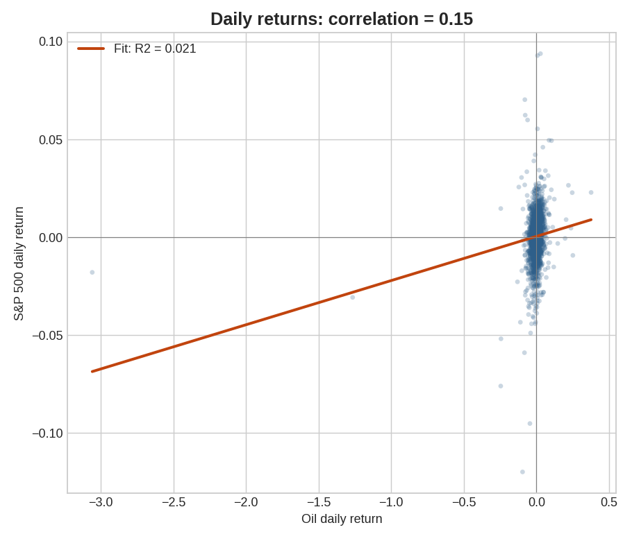

# oil-sp500-analysis
Analyzing the relationship between oil and the S&amp;P500 using python
# Oil Price vs S&P 500 Analysis

## Overview
This project investigates whether daily changes in crude oil prices are related to daily returns of the S&P 500 using historical data downloaded from Yahoo Finance.

## Tools Used
- Python
- Google Colab
- Pandas
- yfinance
- Matplotlib
- SciPy

## Method
The data was cleaned, converted into daily percentage returns, and analyzed using Pearson correlation and simple linear regression.

## Results
- Correlation: **0.1453**
- R²: **0.0211**
- p-value: **2.46 × 10⁻¹³**

These results indicate a weak positive relationship between oil prices and the S&P 500. Although the relationship is statistically significant, oil returns explain only about **2.1%** of the variation in S&P 500 returns.

## Charts

## Limitations
This project demonstrates correlation rather than causation. Other economic factors, such as interest rates, inflation, and global events, can also influence stock market performance.
